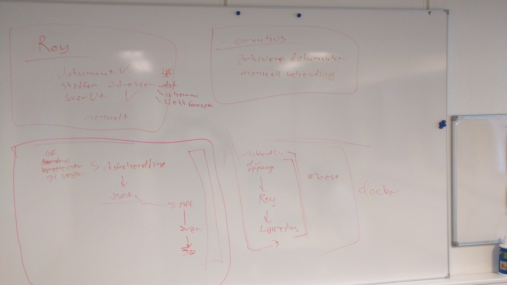

# 19. januar 2016

Gjorde alvor av bloggingen. Har hatt planer om dette helt siden starten, men har ikke kommet igang før nå.
Er fortsatt en del som må fylles ut bakover i tid. I dag opprettet jeg posten med en gang og fyller på etterhvert. Eneste måte å få gjennomført det på.

Fikk endelig svar fra Fronter i dag. De kunne ikke påta seg annen utvikling enn forbedring og feilretting på eksisterende funksjonalitet.
Hadde strengt tatt glemt vi ventet på svar.

Tok tak i Roy igjen. I alle fall nok tak til å starte på beskrivelse og regelsett. Utfordringene her blir å lage noe som ikke tråkker i bena på saksbehandlingsmodulen og Laurentius.
Det kan tenkes at saksbehandlingsmodulen egentlig skal være omkringliggende og så ligger Roy og Laurentius innbakt i saksbehandlerkjeden.
Prøver å få til litt tavletid med @maccyber så vi kan tegne opp løpet for varsler, Roy og Laurentius... samtidig som vi har et blikk over til skoleskyss og ser på hva vi lærte av den jobben

Tavletid unnagjort

Oversatt fra kråketærne:
- Roy og Laurentius blir separate moduler
- Saksbehandlingsmodulen for varsler vil innneholde Roy og Laurentius
- Saksbehandlingsmodulen for skoleskyss skrive om ved neste mulighet
- Det hadde vært digg å ha saksbehandlingsmodulen i Docker

## Web
- Sort skrift på skjema
- Fikset padding på innloggingsboksen

## Moduler
- [roy](https://github.com/telemark/roy) Startet på beskrivelse og regelsett
- [tfk-is-hemmelig-adresse](https://github.com/telemark/tfk-is-hemmelig-adresse) ble ferdig og publisert til [npm](https://www.npmjs.com/package/tfk-is-hemmelig-adresse)
- [tfk-saksbehandling-elev-varsel](https://github.com/telemark/tfk-saksbehandling-elev-varsel) ble opprettet

[<- 18. januar 2016](2016-01-18.md)  |  [Forsiden](../index.md)