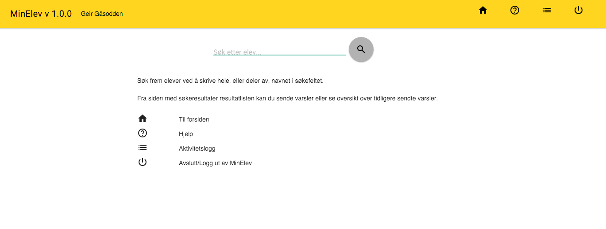

# 01. februar 2016

Uke 3 av tfk-varsel/louie-web/MinElev er i gang :-) Kjært barn har som kjent mange navn.

MinElev er navnevinneren av forslag til hva vi skal kalle webgrensesnittet.

For å feire flyttet vi all kode fra louie-web til MinElev. Det er i MinElev all videre utvikling skal foregå.
Det vil si. Det er ikke så mye mer utvikling som skal gjøres på webgrensesnittet. Denne uken åpner vi en test for alle som vil se og prøve.
Mot slutten skal vi også ha en grundig test med reell produksjon og utsendelse av varsler. For å få dette i havn vil resten av arbeidet ligge i å få på plass alle moduler som skal ligge i bakkant.

Her er en liten sniktitt på forsiden

Ellers gikk det meste av dagen i dag med til saksbehandlermodulen og testing maler.

Vi har egentlig tenkt at selve genereringen av varselbrevene skal foregå i [Roy]() men for å få testet ting fortløpenede laget jeg oppsettet i saksbehandleren i dag.

De første testene ser ut til å ha gått svært greit.

## web
- hjelpetekster
- visuelle forbedringer
- oppsett av testside

## moduler
[tfk-saksbehandling-elev-varsel](https://github.com/telemark/tfk-saksbehandling-elev-varsel) oppdaterte maler
[tfk-saksbehandling-elev-varsel](https://github.com/telemark/tfk-saksbehandling-elev-varsel) dokumentasjon av malkoder
[tfk-saksbehandling-elev-varsel](https://github.com/telemark/tfk-saksbehandling-elev-varsel) oppsett av data til maler
[tfk-saksbehandling-elev-varsel](https://github.com/telemark/tfk-saksbehandling-elev-varsel) test av malgenerering
[laurentius]
[tfk-metadata-generator]

[<- 29. januar 2016](../01/2016-01-29.md)  |  [Forsiden](../../index.md)